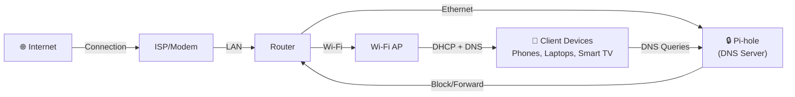

## Agenda (60 minutes)

### 1. Welcome & Context (5 min)

- Brief introductions
- Why home networking matters
- Common pain points: ads, tracking, slow and insecure DNS

### 2. Understanding DNS Basics (10 min)

- What is DNS and how it works
- The problem: unfiltered DNS queries
- Privacy and security implications

### 3. Introducing Pi-hole (10 min)

- What is Pi-hole?
- How it works as a network-wide ad blocker
- Key benefits: privacy, speed, control
- Hardware requirements (Raspberry Pi, Docker, etc.)

### 4. Installation Walkthrough (15 min)

- Prerequisites and setup
- Step-by-step installation process
- Configuration basics
- Integrating with your router

### 5. Configuration & Customization (10 min)

- Alternative methods
- Blocklists and whitelisting
- Dashboard overview
- Query logging and analytics
- Advanced settings (conditional forwarding, etc.)

### 6. Troubleshooting & Best Practices (5 min)

- Common issues and solutions
- Performance optimization
- Maintenance tips

---

## 1. Welcome & Context (5 min)

- Brief introductions
- Why home networking matters
- Common pain points: ads, tracking, slow and insecure DNS

---

### Home network architecture

---

## 2. Understanding DNS Basics (10 min)

- What is DNS and how it works
- The problem: unfiltered DNS queries
- Privacy and security implications

---

## Demo: Default setup

**Live demo steps:**

1. Show network layout and device configuration
2. Open Pi-hole admin dashboard
3. Inspect recent queries in real-time
4. Highlight blocked vs allowed domains
5. Review performance impact and statistics

---

### 3. Introducing Pi-hole (10 min)

- What is Pi-hole?
- How it works as a network-wide ad blocker
- Key benefits: privacy, speed, control
- Hardware requirements (Raspberry Pi, Docker, etc.)

**Live demo steps:**

1. Show network layout and device configuration
2. Open Pi-hole admin dashboard
3. Inspect recent queries in real-time
4. Highlight blocked vs allowed domains
5. Review performance impact and statistics

---

### 4. Installation Walkthrough (15 min)

- Prerequisites and setup
- Step-by-step installation process
- Configuration basics
- Integrating with your router

**Live demo steps:**

1. Show network layout and device configuration
2. Open Pi-hole admin dashboard
3. Inspect recent queries in real-time
4. Highlight blocked vs allowed domains
5. Review performance impact and statistics

---

### 5. Configuration & Customization (10 min)

- Blocklists and whitelisting
- Dashboard overview
- Query logging and analytics
- Advanced settings (conditional forwarding, etc.)

---

### 6. Troubleshooting & Best Practices (5 min)

- Common issues and solutions
- Performance optimization
- Maintenance tips

## Key takeaways

- **Visibility first**: Query logs show you what's happening on your network
- **DNS is powerful**: One DNS change affects all devices automatically
- **Block thoughtfully**: Start conservative, expand blocklists gradually
- **Learn & iterate**: Use Pi-hole as a learning tool, not just an ad blocker
- **Keep it simple**: Simple setups are easier to maintain and explain to others

---

## Questions?

Pi-hole docs: [https://docs.pi-hole.net/](https://docs.pi-hole.net/)

Thank you!
