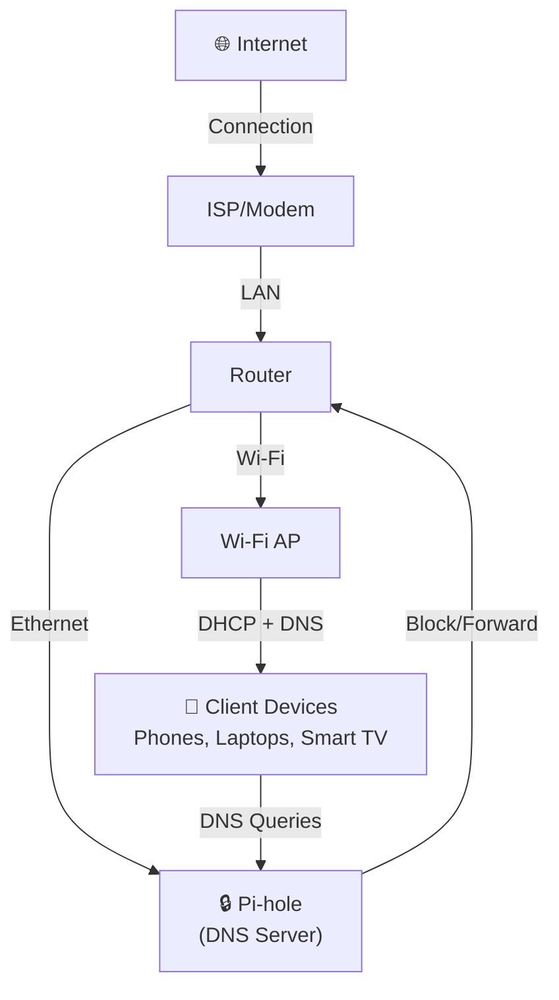
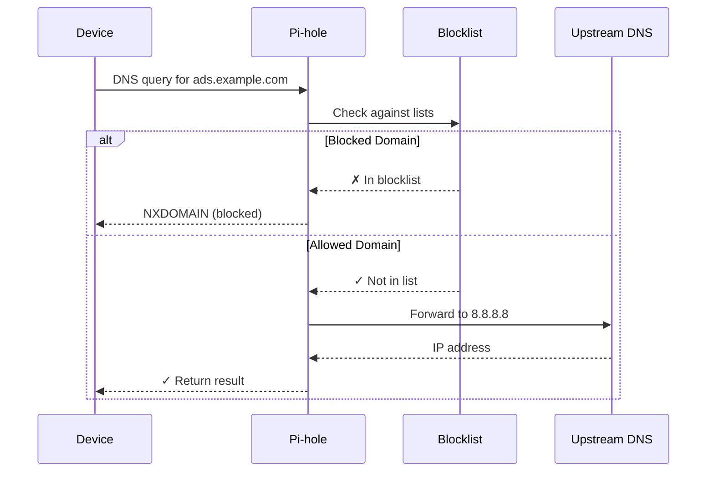
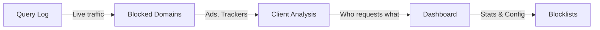

# Intro to Home Networking

### Using Pi-hole to understand, control, and simplify your home network

CodeHub meetup deck

---

## What we will cover

- Home network basics and the pieces that matter
- Where Pi-hole fits in the stack
- DNS, DHCP, and device discovery in plain language
- A practical setup path you can repeat later
- A little extra security

---

## Home network architecture

---

## DNS query flow with Pi-hole

---

## Demo: What we'll show

**Live demo steps:**
1. Show network layout and device configuration
2. Open Pi-hole admin dashboard
3. Inspect recent queries in real-time
4. Highlight blocked vs allowed domains
5. Review performance impact and statistics

---

## Key takeaways

- **Visibility first**: Query logs show you what's happening on your network
- **DNS is powerful**: One DNS change affects all devices automatically
- **Block thoughtfully**: Start conservative, expand blocklists gradually
- **Learn & iterate**: Use Pi-hole as a learning tool, not just an ad blocker
- **Keep it simple**: Simple setups are easier to maintain and explain to others

---

## Questions?

Pi-hole docs: https://docs.pi-hole.net/

Thank you!
